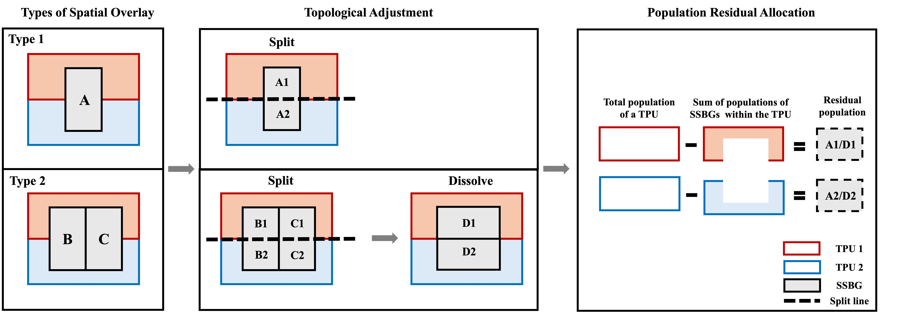
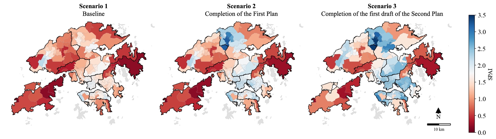
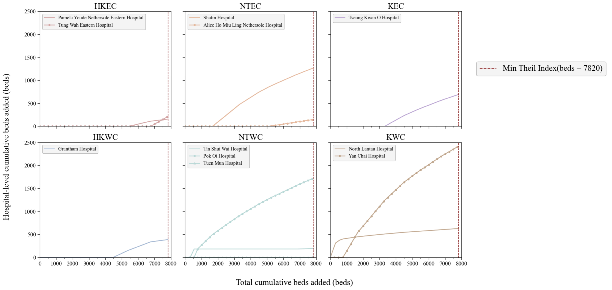
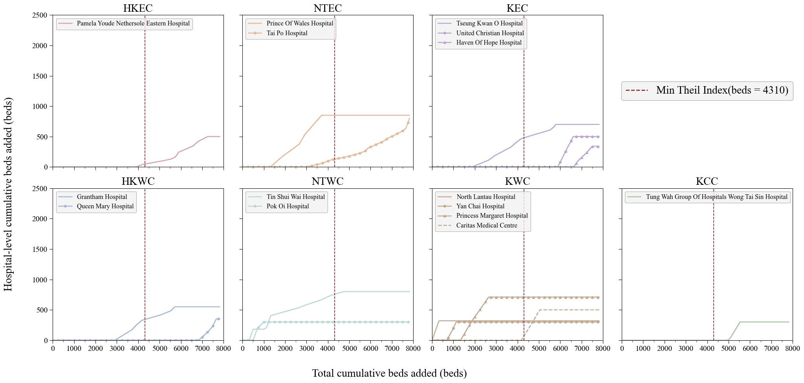
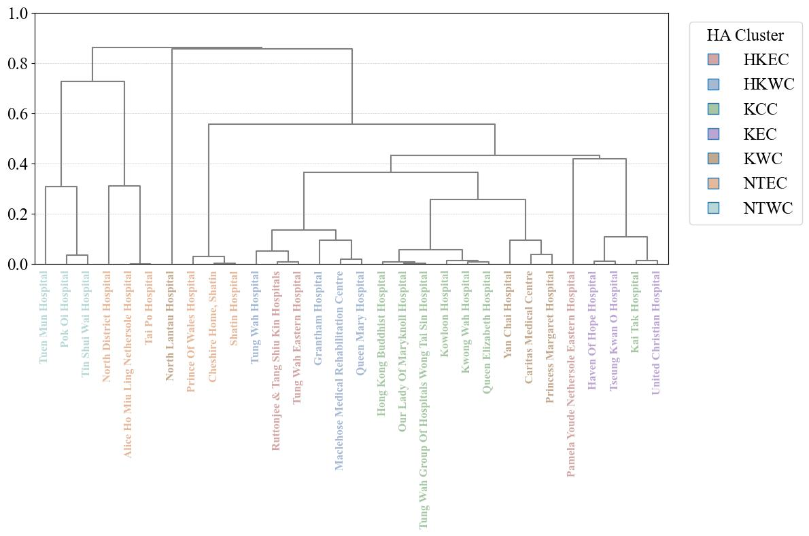
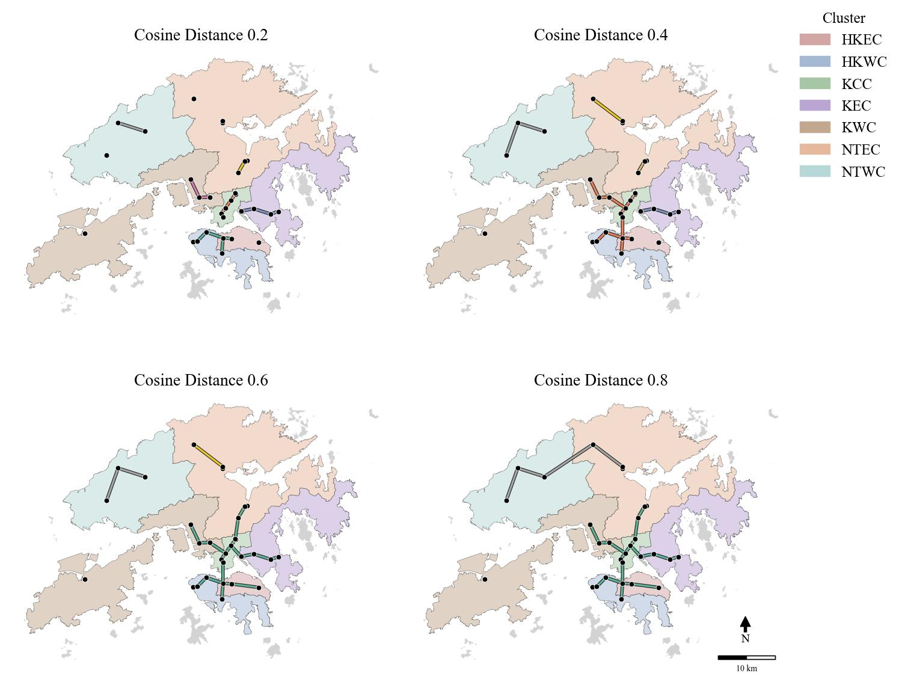

# HospAccessHK

### A Spatial Decision-Support Framework for Hospital Accessibility and Planning in Hong Kong

**MSc Urban Spatial Science Dissertation Project | UCL Centre for Advanced Spatial Analysis (CASA) | 2025**

HospAccessHK is a spatial analysis framework for evaluating public hospital accessibility, optimising hospital expansion priorities, and assessing the restructuring of Hospital Authority (HA) clusters in Hong Kong.

---

## Table of Contents

- [1. Background](#1-background)
- [2. Workflow](#2-workflow)
- [3. Data](#3-data)
  - [3.1 Data Source](#31-data-source)
  - [3.2 Data Processing](#32-data-processing)
    - [3.2.1 Island Removal](#321-island-removal)
    - [3.2.2 Population-weighted Centroids](#322-population-weighted-centroids)
    - [3.2.3 Travel Time Matrix](#323-travel-time-matrix)
- [4. Methodology](#4-methodology)
  - [4.1 Spatial Accessibility Index (SPAI)](#41-spai-and-theil-index)
  - [4.2 Expansion Optimization](#42-expansion-optimization)
  - [4.3 Clustering Analysis](#43-clustering-analysis)
- [5. Results](#5-results)
  - [5.1 Spatial Accessibility Index (SPAI)](#51-spai-and-theil-index)
  - [5.2 Expansion Optimization](#52-expansion-optimization)
  - [5.3 Clustering Analysis](#53-clustering-analysis)
- [6. Conclusion](#6-conclusion)
- [7. Key Reference](#7-key-reference)
---

## 1. Background

Hong Kong's public healthcare system faces increasing pressure from population growth, ageing, and major urban development. At the same time, hospital expansion involves substantial financial costs and is constrained by the existing distribution of healthcare resources.

The Hospital Authority currently organises public hospitals into seven geographical clusters. However, administrative boundaries do not necessarily correspond to actual healthcare accessibility or functional patient catchments.

HospAccessHK therefore addresses three planning questions:

RQ 1. **How does spatial accessibility change under different demographic and hospital-development scenarios?**  

RQ 2. **Which hospital expansion projects should be prioritised under the Second 10-year Hospital Development Plan?**  

RQ 3. **Do estimated patient flows support restructuring the existing Hospital Authority cluster system?**  

The project moves from measuring accessibility to identifying actionable planning priorities.

---

## 2. Workflow

<p align="center">
  
</p>

<p align="center">
  <i>Fig. 1. HospAccessHK research workflow</i>
</p>

---

## 3. Data

### 3.1 Data Source

Hong Kong is divided into **Tertiary Planning Units (TPUs)** for planning purposes, which are further subdivided into smaller spatial units such as street blocks and village clusters. Adjacent subunits with small populations are aggregated into **Small Street Block Groups (SSBGs)**.

In this project, SSBGs are used as the smallest spatial unit for 2021 census population data, while TPUs are used for projected population data. Hong Kong is also divided into **18 administrative districts**, which form the basis of the Hospital Authority's **7 geographical clusters**.

<p align="center">
  <i>Table. 1. Data Source</i>
</p>

| Spatial Data | Geometric Type | Identifier | Attribute Data | Year | Sources |
|---|---|---|---|---|---|
| SSBG boundaries | Polygon | *ssbg_pop* | Population by SSBG | 2021 | CSDI |
| TPU boundaries | Polygon | *tpu_pop* | Population by TPUs | 2021 | CSDI |
| Projected population by TPUs | — | *tpu_pop* | Projected population by TPUs | 2023, 2027, 2036 | CSDI; Census and Statistics Department |
| District boundaries | Polygon | *district* | Respective HA cluster | — | CSDI; Hospital Authority |
| Hospital locations | Point | *hosp* | Number of general beds by hospital | 2023–2024 | CSDI; Hospital Authority |
| Road centre lines | Polyline | *road_nw* | Speed limits; travel direction | 2025 | CSDI |

### 3.2 Data Processing

<p align="center">
  
</p>

<p align="center">
  <i>Fig. 2. Overview of data processing</i>
</p>

#### 3.2.1 Island Removal

Outlying islands without road-network connectivity were excluded before accessibility analysis. Using QGIS, multipolygon SSBG, TPU, and district datasets were split into individual polygons, disconnected island polygons were removed, and the remaining geometries were dissolved by spatial unit code.

The preprocessing removed **3 TPUs and 21 SSBGs**. Population values were adjusted for partially removed units, while island polygons with no registered population were treated as uninhabited.

This ensures that disconnected islands do not bias population-weighted centroid and travel-time calculations.

#### 3.2.2 Population-weighted Centroids

Travel-time estimation requires a representative origin point for each TPU. However, geometric centroids may poorly represent actual population locations when population is unevenly distributed. This is particularly relevant in Hong Kong because of its mountainous terrain and highly concentrated urban development. Population-weighted centroids were therefore calculated using the population and centroid coordinates of SSBGs within each TPU:

$$
X_{TPU} = \frac{\sum P_i X_i}{\sum P_i}
$$

$$
Y_{TPU} = \frac{\sum P_i Y_i}{\sum P_i}
$$

where:

- $P_i$ represents the population of SSBG $i$;
- $X_i$ represents its x-coordinate;
- $Y_i$ represents its y-coordinate.

Cases where **SSBGs overlapped multiple TPUs** were spatially split and their residual populations were redistributed before the weighted centroids were calculated (shown in Fig.3)

<p align="center">
  
</p>

<p align="center">
  <i>Fig. 3. Illustration of Population Residual Allocation</i>
</p>

For **concave TPUs**, the calculated population-weighted centroid fell outside the polygon boundary. In these cases, the nearest point on the TPU boundary was used as the adjusted origin.

#### 3.2.3 Travel Time Matrix

The **shortest driving time** between each TPU population-weighted centroid and public hospital was used to represent travel impedance. Using **NetworkX**, a directed road network was constructed from road length, speed limits, and travel-direction information. The nearest network nodes for TPU centroids and hospitals were identified, and **Dijkstra's algorithm** was used to calculate the shortest travel time between them.

---
## 4. Methodology

### 4.1 SPAI and Theil Index
The **Modified Huff Three-Step Floating Catchment Area (MH3SFCA)** model was used to measure spatial accessibility. This study adopts the MH3SFCA method as described by **Subal et al. (2021)** and **Fowler et al. (2022)**. The calculation involves four main steps:
1. Define the catchment-area threshold and distance-decay function.
2. Calculate Huff probability for each TPU–hospital pair.
3. Estimate hospital supply–demand ratios.
4. Calculate the Spatial Accessibility Index (SPAI).

#### Model Settings
The 35-minute threshold represents the maximum acceptable travel time used in the analysis and ensures that each TPU has access to at least one hospital within its catchment area. The distance-decay function and parameter settings were informed by **Delamater et al. (2019)**, who evaluated four distance-decay functions under four parameter settings using inpatient hospitalisation data from the State of Michigan, USA. The parameter setting and the distance-decay function were adopted in this project to represent relatively high sensitivity to travel distance.

- **Catchment threshold:** 35 minutes
- **Distance-decay function:** Downward Log Logistic
- **Parameter setting:** $\alpha = 8.34$, $\beta = 2.39$
- **Hospital attractiveness:** number of general beds

#### Distance-decay Weight

The distance-decay weight is calculated as:

```math
W_{ij}
=
\frac{1}
{1 + (\alpha t_{ij})^\beta}
```

where:

- $t_{ij}$ = travel time between TPU $i$ and hospital $j$;
- $\alpha$ and $\beta$ = distance-decay parameters;
- $W_{ij}$ = distance-decay weight for the TPU–hospital pair.

#### Huff Probability

The probability that residents in TPU $i$ choose hospital $j$ is calculated as:

```math
P_{ij}
=
\frac{S_j W_{ij}}
{\sum_{k \in \{t_{ik} \leq t_{\max}\}} S_k W_{ik}}
```

where:

- $S_j$ = number of general beds at hospital $j$;
- $W_{ij}$ = distance-decay weight;
- $P_{ij}$ = probability that residents in TPU $i$ choose hospital $j$.

#### Hospital Supply–Demand Ratio

The supply–demand ratio for hospital $j$ is calculated as:

```math
R_j
=
\frac{S_j}
{\sum_{i \in \{t_{ij} \leq t_{\max}\}} P_{ij}D_i}
```

where:

- $D_i$ = population of TPU $i$;
- $P_{ij}D_i$ = potential demand from TPU $i$ for hospital $j$;
- $R_j$ = supply–demand ratio of hospital $j$.

#### Spatial Accessibility Index

Finally, the SPAI for TPU $i$ is calculated as:

```math
A_i
=
\sum_{j \in \{t_{ij} \leq t_{\max}\}}
P_{ij}R_jW_{ij}
\times 1{,}000
```

where:

- $A_i$ = Spatial Accessibility Index for TPU $i$;
- $P_{ij}$ = Huff choice probability;
- $R_j$ = hospital supply–demand ratio;
- $W_{ij}$ = distance-decay weight.

The final SPAI is standardised on a **per 1,000 population basis**.

- **Higher SPAI** → better spatial accessibility
- **Lower SPAI** → poorer spatial accessibility

### 4.2 Expansion Optimization

Following **Fowler et al. (2022)**, hospital expansion was evaluated using two metrics:

- **Average SPAI**, representing the overall level of spatial accessibility;
- **Population-weighted Theil Index**, representing spatial equity.

A greedy algorithm was then used to allocate additional hospital beds while balancing overall accessibility and spatial equity.

#### Average SPAI

The average SPAI across all TPUs is calculated as:

```math
\overline{A}
=
\frac{\sum_{i=1}^{\ell} A_i}{\ell}
```

where:

- $A_i$ = SPAI of TPU $i$;
- $\ell = 208$ = total number of TPUs.

#### Population-weighted Theil Index

The population-weighted Theil Index measures inequality in accessibility:

```math
T_w
=
\sum_{i=1}^{208}
\left(
\frac{D_i}{\sum_{l=1}^{208} D_l}
\cdot
\frac{A_i}{A^{(w)}}
\cdot
\ln
\left(
\frac{A_i}{A^{(w)}}
\right)
\right)
```

where:

- $D_i$ = population of TPU $i$;
- $A_i$ = SPAI of TPU $i$;
- $A^{(w)}$ = population-weighted average accessibility.

A lower Theil Index indicates greater spatial equity, while a value of **0** represents perfect equality.

#### Greedy Algorithm
Among configurations that maintain average SPAI above the **2023 baseline**, the allocation producing the **lowest Theil Index** is selected. The process continues until a total of 7,820 additional beds has been allocated (as shown in Fig.4). 

<p align="center">
  
</p>

<p align="center">
  <i>Fig. 4. Greedy Algorithm</i>
</p>

There are two expansion settings were considered:

- **Setting 1:** no hospital-specific expansion limit;
- **Setting 2:** each hospital is constrained by its planned expansion under the Second 10-year Hospital Development Plan.

In setting 1, we identifies hospitals that are most effective in improving spatial equity. As for setting 2, we evaluates the planned hospital expansion programme under its existing capacity constraints.

### 4.3 Clustering Analysis
Patient flows were estimated using the Huff probabilities derived from the MH3SFCA model. The estimated flow from TPU $i$ to hospital $j$ is:

```math
F_{ij}
=
P_{ij}D_i
```

where:

- $P_{ij}$ = Huff probability that residents in TPU $i$ choose hospital $j$;
- $D_i$ = population of TPU $i$;
- $F_{ij}$ = estimated patient flow from TPU $i$ to hospital $j$.

#### Hierarchical Clustering

Hospitals were clustered according to the distribution of their estimated patient origins. Each hospital is represented by a vector of inflows from different TPUs, and similarity between hospitals is measured using **cosine distance**. A smaller cosine distance indicates more similar patient-origin distributions, with a value of 0 representing identical directional patterns.

Hierarchical clustering was applied using a bottom-up approach:
- hospitals with the most similar patient-flow distributions are grouped first;
- clusters are progressively merged as the cosine-distance threshold increases;
- the resulting dendrogram is used to assess whether functional patient catchments align with the existing Hospital Authority cluster structure.

This approach identifies hospitals that serve similar geographical populations and provides evidence for potential cluster restructuring.

---

## 5. Results

### 5.1 SPAI and Theil Index

<p align="center">
  
</p>

<p align="center">
  <i>Fig.5. Distribution of SPAI under three scenarios</i>
</p>

<p align="center">
  <i>Table.2. Average SPAI and Theil Index.</i>
</p>

| Metric | Scenario 1 | Scenario 2 | Scenario 3 |
|---|---:|---:|---:|
| Average SPAI | 1.39 | 1.71 | 2.04 |
| Theil Index | 0.031 | 0.040 | 0.027 |

### 5.2 Expansion Optimization
<p align="center">
  
</p>

<p align="center">
  <i>Fig.6.Optimization Result by hospitals (Setting 1)</i>
</p>

<p align="center">
  
</p>

<p align="center">
  <i>Fig.7.Optimization Result by hospitals (Setting 2)</i>
</p>

### 5.3 Clustering Analysis
<p align="center">
  
</p>

<p align="center">
  <i>Fig.8.Dendrogram of Hierarchical Clustering (Cosine Distance)</i>
</p>

<p align="center">
  
</p>

<p align="center">
  <i>Fig.9.Maps of Hierarchical Clustering</i>
</p>

---
## 6. Conclusion

---
## 7. Key Reference
- Subal, J., Paal, P. and Krisp, J. M. (2021). ‘Quantifying spatial accessibility of general practitioners by applying a modified Huff three-step floating catchment area (MH3SFCA) method’. *International Journal of Health Geographics*, 20(1), p. 9. https://doi.org/10.1186/s12942-021-00263-3

- Fowler, D., Middleton, P. and Lim, S. (2022). ‘Extending floating catchment area methods to estimate future hospital bed capacity requirements’. *Spatial and Spatio-temporal Epidemiology*, 43, p. 100544. https://doi.org/10.1016/j.sste.2022.100544

- Delamater, P. L., Shortridge, A. M. and Kilcoyne, R. C. (2019). ‘Using floating catchment area (FCA) metrics to predict health care utilization patterns’. *BMC Health Services Research*, 19, p. 144. https://doi.org/10.1186/s12913-019-3969-5
